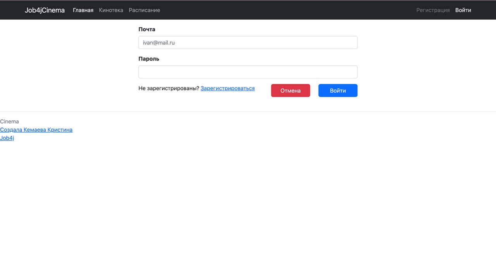
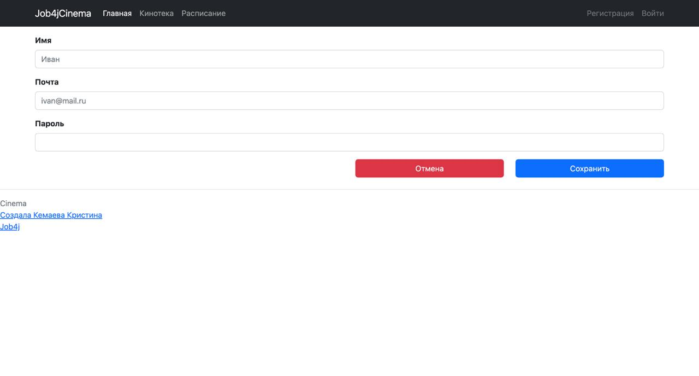
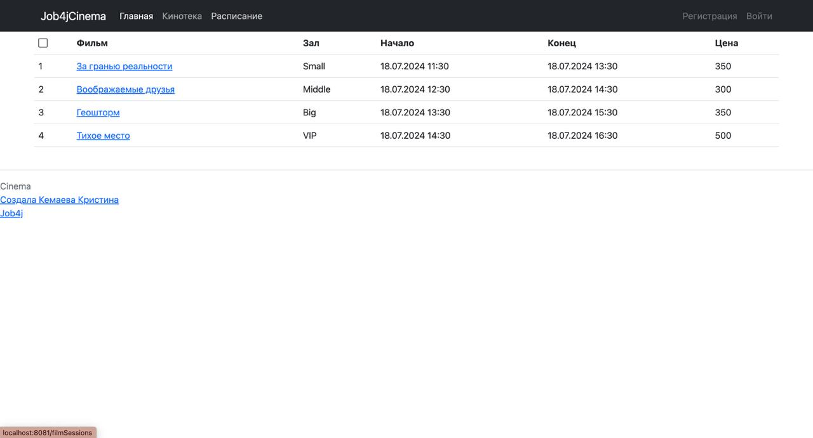
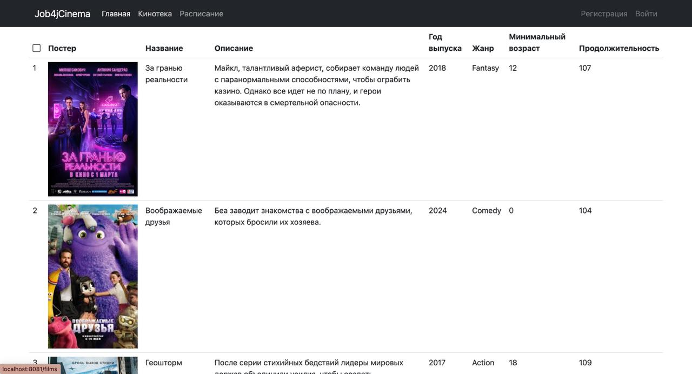
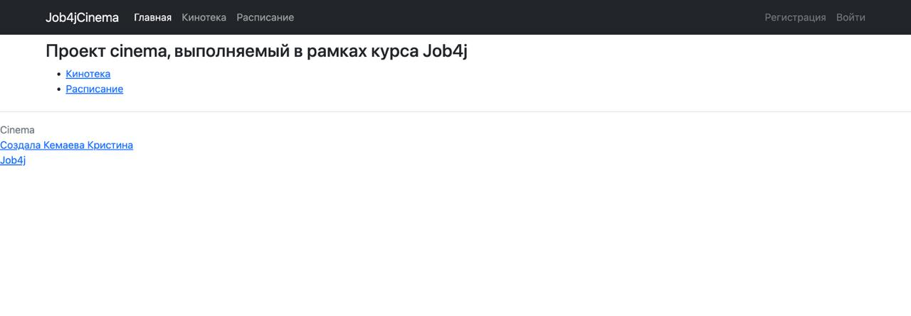
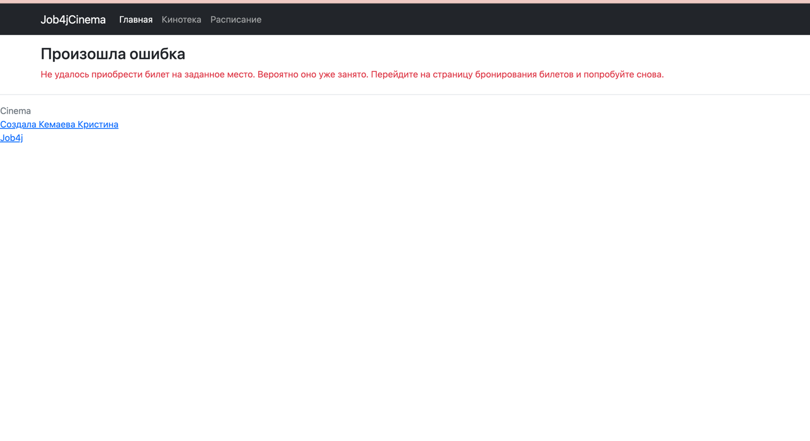

## job4j_cinema 
# Сайт по покупке билетов в кинотеатр
## Стек технологий
- Java 17
- Spring Boot
- Thymeleaf
- Bootstrap
- Liquibase
- Sql2o
- PostgreSQL
- Mockito
- Junit 
- Html
- H2
## Описание: 
Приложение разработано для автоматизации покупки билетов в кинотеатр.
## Возможности:
## 1) Регистрация/вход
На сайте предусмотрена авторизация. Пользователь может просматривать всю информацию на сайте, но чтобы приобрести билет необходимо зарегистрироваться/выполнить вход в свой профиль.

## 2) Вывод киносеансов и фильмов
На сайте есть кинотека - в ней представлены фильмы, на которые можно приобрести билет.

## 3) Покупка билетов
Сервис позволяет выбрать фильм, сеанс, место и ряд в зале.
При неудачной покупке, в случае если место занято, сервис предупреждает, что нужно выбрать другое место.

